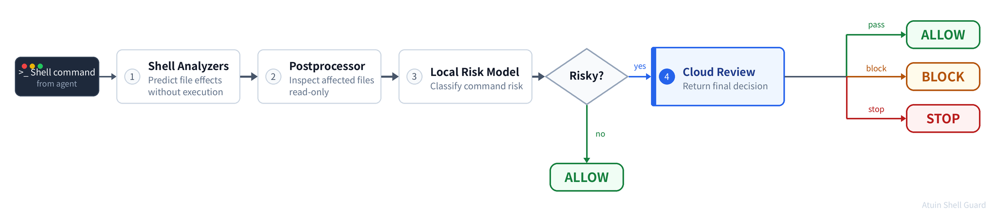

# Privacy & Data Usage Notice

Cloud review is enabled by default.

When cloud review is enabled and the local risk model determines that a command may pose risk, the tool-call command that the agent is about to execute, metadata of potentially affected user-side resources (e.g. file names, file sizes, creation times), the randomly generated installation ID, conversation ID (when available), error logs, and telemetry data will be uploaded to Tencent's cloud services for processing. We may use this data to improve our product experience.

- Privacy Policy: [PRIVACY.md](https://github.com/XuanwuLab/atuin-shell-guard/blob/main/PRIVACY.md)

- User Service Agreement: [USER_SERVICE_AGREEMENT.md](https://github.com/XuanwuLab/atuin-shell-guard/blob/main/USER_SERVICE_AGREEMENT.md)

Please review both documents carefully before using any software provided by this repository. By installing or enabling the plugin or hook scripts from this repository on any agent platform, or by otherwise using any content from this repository, you acknowledge that you have read and agree to the Privacy Policy and User Service Agreement.

# Offline Mode

To disable cloud review, write the following to `~/.atuin-shell-guard/config.json` (on Windows, `%USERPROFILE%\.atuin-shell-guard\config.json`):

```json
{"cloud-review": "no"}
```

# Atuin Shell Guard

Predictive Auto-Review for AI coding agents. Atuin Shell Guard combines local, read-only abstract execution with optional cloud review to predict filesystem, Git-state, and external-resource consequences before a command runs. Risky operations can be returned to the agent with those consequences so it can **RETHINK**.

> It is a barrier, not a sandbox — allowed commands still execute normally via the OS.

## How It Works



The plugin registers a **pre-tool-call hook** in the agent runtime. Every time the agent is about to run a shell command, the hook fires a multi-stage pipeline:

1. **Shell Analyzers** (local) — Parse Bash into an AST and walk it without executing anything. They expand variables, arrays, globs, braces, substitutions, and modeled control flow to predict filesystem, Git-state, and external-resource effects. When the hook process runs on Windows, PowerShell commands—including nested `pwsh`/`powershell -Command` invocations—are analyzed with a separate PowerShell parser and cmdlet model derived from the official PowerShell source. The analysis is conservative and may over-report possible effects, but unsupported, highly dynamic, malformed, or excessively complex input may also be missed or produce incomplete results.

2. **Postprocessor** (local) — Takes exact destructive paths and `stat()`s them on the real filesystem (read-only). Collects file metadata such as extension, size, and creation date, then groups results by extension and sorts them by age and size. Only exact, existing delete and overwrite targets contribute to file-count, size, age, and extension statistics. Predicted paths that do not exist may still appear as effects but do not contribute to those statistics. Separate direct path, special-device, Git-state, and external-resource rules can classify a command without enumerating existing files.

3. **Local Risk Model** — Evaluates affected-file statistics together with direct path, special-device, Git-state, and external-resource policy facts.

4. **Cloud Risk Evaluation** — When cloud review is enabled and the local model classifies a command as risky or critical, the command and bounded affected-resource metadata are uploaded to Tencent's cloud services for further analysis. A valid cloud response returns `pass`, `block`, or `stop` and is authoritative for the reviewed operation: `block` leaves the command unexecuted and returns its consequences so the agent can reconsider, while `stop` tells the agent to terminate the current work and await the user. A timeout, network error, or invalid response preserves the local decision.

## How Risk Model Works

The local risk model classifies predicted effects as safe, risky, or critical. It inspects files on disk that the abstract execution predicts would be deleted or overwritten and also evaluates direct path, special-device, Git-state, and external-resource risks. When cloud review is enabled, risky and critical results are submitted for review. A valid cloud `pass`, `block`, or `stop` response determines the final outcome for the reviewed operation; review failures preserve the local result.

A predicted effect on a path that does not exist on disk may still be reported, but it does not contribute to file metadata statistics. This does not prevent separate direct-risk rules from classifying the operation.


## Installation

- [Claude Code](https://github.com/XuanwuLab/atuin-shell-guard/blob/main/guides/CLAUDE_CODE.md)
- [Codex CLI](https://github.com/XuanwuLab/atuin-shell-guard/blob/main/guides/CODEX.md)
- [Kimi Code CLI](https://github.com/XuanwuLab/atuin-shell-guard/blob/main/guides/KIMI.md)
- [Hermes Agent](https://github.com/XuanwuLab/atuin-shell-guard/blob/main/guides/HERMES_AGENT.md)

Codex users must review and trust the Atuin Shell Guard hook in `/hooks`. Until the hook is trusted, Codex skips it and the guard cannot inspect commands. Codex may require review again after the hook definition changes.

## Known Limits

Atuin Shell Guard is designed primarily to reduce accidental data loss caused by well-intentioned agents. It is not designed to contain an adversary who can influence an agent through prompt injection, a compromised model or toolchain, or other untrusted instructions. The hook analyzes the proposed command and its predicted effects; it cannot reliably determine whether the command reflects the user's intent or was produced in response to injected instructions.

An adversary may deliberately construct obfuscated or dynamic shell payloads to evade analysis. Atuin Shell Guard models bounded process substitution, indexed and associative arrays, resolvable `eval`, and bounded `source` file analysis, but unresolved or oversized forms widen the result or produce warnings instead of being executed. Remaining Bash gaps include arithmetic `for` loops, execution of `select` and `coproc`, trap and signal semantics, exact `[[ ... =~ ... ]]` regex and extglob evaluation, and behavior hidden inside unmodeled interpreters, unresolved runtime-generated scripts, or downloaded code. PowerShell is not a full runtime; full expression evaluation, general script or module loading, and provider-specific dynamic behavior remain outside the model.

The analyzers are deliberately bounded and implement only selected shell and command semantics. Unsupported, malformed, adversarially complex, or excessively nested input can produce incomplete results or parser failure. In some cases no destructive effect is reported and the command may be allowed. Atuin Shell Guard is therefore not a sandbox or a security boundary for executing untrusted code. Use operating-system permissions, isolation, backups, and human review as independent controls, especially when agents process untrusted repository content, webpages, tool output, or other prompt-injection sources.
